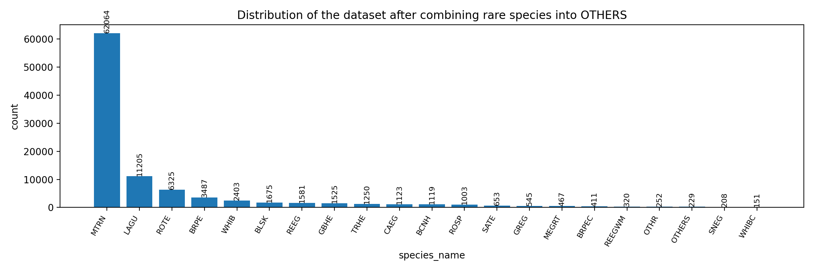
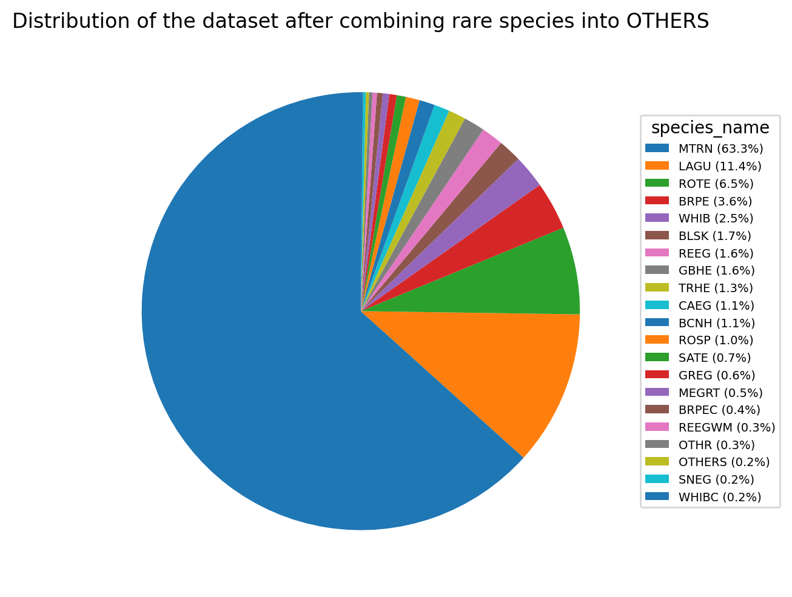

# Data Lineage

Documents the origin, transformations, and flow of all data used in this project.

---

## Project Context

**Project**: Texas Colonial Waterbird AI Pipeline

**Goal**: Automate counting and classification of colonial waterbirds from aerial survey imagery, replacing manual human counting of birds in extremely large orthomosaic images (~10,000 x 10,000 pixels).

### High-Level Pipeline Vision

1. Bird Detection
2. Bird Species Classification
3. Post-processing + counting
4. Geospatial mapping of detections

This repository covers **Stage 2 (Classification)**, building on detection work from Stage 1.

### Participants

| Person | Role |
|--------|------|
| Hank Arnold | Domain expert / project sponsor (Audubon / field ecology) |
| Dr. Arko Barman | Rice Data Science Lab PI |
| Nomin Ganzorig | Student researcher |
| Saahil Vohra | Student researcher (initial classification exploration) |
| Surya | Student researcher (built initial detection model) |
| Radhey, Richard | Collaborators |

---

## Stage 1: Original Aerial Imagery → Tiled Detection Dataset

### Source

- **Created by**: Hank Arnold
- **Date**: Oct 21, 2025
- **Original system location**: `Training Image Sets / 20251020 512 Species`
- **Purpose**: Train a species classification model using bird detections from Co-DETR

### Image Tiling Strategy

Original aerial survey imagery consists of ~10,000 x 10,000 pixel orthomosaics. These were split into **512 x 512 pixel tiles** for machine learning.

Properties:
- Tiles may contain **multiple birds**
- Tiles may **overlap** spatially
- Birds near tile boundaries may appear in **multiple tiles**

### Tile Naming Pattern

```
images\102741 - 00031.jpg
images\102741 - 00032.jpg
```

- `102741` → original orthomosaic image ID
- `00031` → tile number from that image

### Annotation Format (COCO-style)

The dataset uses a COCO-style JSON with sections: `images`, `categories`, `annotations`, `info`.

**Images** — each tile:
```json
{
  "width": 512,
  "height": 512,
  "id": 33,
  "file_name": "images\\102741 - 00033.jpg"
}
```

**Categories** — 33 bird species classes:
```json
{
  "id": 30,
  "name": "WHIB"
}
```

Example species codes: ROTE (Royal Tern), SATE (Sandwich Tern), WHIB (White Ibis). Some classes represent grouped species (e.g., LWBA/LWBB).

**Annotations** — one bounding box per bird:
```json
{
  "id": 0,
  "image_id": 1,
  "category_id": 5,
  "bbox": [390, 58, 90, 41],
  "iscrowd": 0,
  "area": 3690
}
```

Coordinates are relative to the 512x512 tile. `bbox` format is `[x, y, width, height]`.

### Where this lives

| Artifact | Path |
|----------|------|
| Original annotation JSON (Hank's export) | `data/classification_original_training.json` |
| Original 512x512 tile images | **Not stored in this repo** (provided by Hank, used for cropping only) |

---

## Stage 2: Tiled Dataset → Classification Crops

### Transformation

Saahil converted the tiled detection dataset into single-bird classification crops.

**Pipeline**:

```
512x512 tile
      ↓
  bounding boxes from Training.json
      ↓
  crop individual bird (with 10% bbox margin)
      ↓
  resize + pad to 224x224
      ↓
  save to species folder
```

**Crop naming format**: `{image_id}_{annotation_id}.jpg` (e.g., `31_124.jpg`)

### Output structure

```
data/crops/
    AMAV/
    AMOY/
    AWPE/
    ...
    WHIB/
    WHIBC/
    WHIBJ/
```

Each crop contains one bird, resized to 224x224.

### Key characteristics

- **One crop per annotation** — every bounding box becomes one image
- **Possible duplicate birds** — birds near tile boundaries may produce multiple crops from overlapping tiles
- **No deduplication performed** at this stage

### Where this lives

| Artifact | Path |
|----------|------|
| Cropping script | `data/saahil_code/crop_and_pad.py` |
| Folder creation script | `data/saahil_code/create_folders.py` |
| Classification crop images | `data/crops/` |

---

## Stage 3: Exploratory Data Analysis & Class Consolidation

Starting from the cropped dataset Saahil produced (`data/crops/`), we performed EDA to understand the class distribution before training.

### Raw Crop Distribution (33 species)

The original crop dataset has an extreme long-tailed distribution across all 33 species:


| Species | Crops | | Species | Crops |
|---------|------:|-|---------|------:|
| MTRN | 62,064 | | GREG | 545 |
| LAGU | 11,205 | | MEGRT | 467 |
| ROTE | 6,325 | | BRPEC | 411 |
| BRPE | 3,487 | | REEGWM | 320 |
| WHIB | 2,403 | | OTHR | 252 |
| BLSK | 1,675 | | SNEG | 208 |
| REEG | 1,581 | | WHIBC | 151 |
| GBHE | 1,525 | | GREGC | 92 |
| TRHE | 1,250 | | TCHE | 55 |
| CAEG | 1,123 | | RUTU | 37 |
| BCNH | 1,119 | | AWPE | 20 |
| ROSP | 1,003 | | WHIBJ | 6 |
| SATE | 653 | | BNST | 5 |
|  |  | | AMAV, BEKI, RBGU, DCCO, AMOY, TUVU, OSPR | 1–4 each |

Key observations:
- **MTRN (Mixed Terns) dominates** at 62,064 crops — 63.3% of the entire dataset
- The top 3 species (MTRN, LAGU, ROTE) account for ~81% of all crops
- 12 species have fewer than 100 samples; several have fewer than 10

### Class Consolidation (< 100 → OTHERS)

Species with fewer than 100 crops were merged into an **OTHERS** class, reducing the dataset from 33 to 21 classes. This prevents the model from trying to learn species with insufficient training data.





After consolidation, the OTHERS class contains 229 crops (combined from GREGC, TCHE, RUTU, AWPE, WHIBJ, BNST, AMAV, BEKI, RBGU, DCCO, AMOY, TUVU, OSPR).

### Suspected Duplication Problem

The crop counts above are likely **inflated by duplicate birds**. Because the original 512x512 tiles overlap spatially, the same physical bird can appear in multiple tiles. When Saahil's cropping script extracts one crop per annotation, a single bird near a tile boundary produces multiple nearly-identical crops.

This matters because:
- **Inflated counts misrepresent true data size** — the 62,064 MTRN crops likely correspond to far fewer unique birds
- **Not equivalent to data augmentation** — unlike intentional augmentation (flips, rotations, color jitter), these duplicates are near-identical copies that don't add meaningful variety
- **Biased training signal** — birds that happen to fall on tile boundaries are seen more frequently during training, giving the model a skewed view of what each species looks like
- **Leakage risk** — duplicate crops of the same bird could end up in different splits (though grouped splitting by parent image mitigates this for crops from the same orthomosaic)

**Ideal next step**: Deduplicate the crop dataset to get true unique-bird counts before training. This would give a more accurate picture of the actual class distribution and prevent the model from over-fitting to duplicated individuals.

### Where this lives

| Artifact | Path |
|----------|------|
| Raw distribution bar chart | `data_exploration/original distribution/species_bar_original.png` |
| Consolidated distribution bar chart | `data_exploration/comibined_t100_dataset/metadata_species_distribution.png` |
| Consolidated distribution pie chart | `data_exploration/comibined_t100_dataset/metadata_species_distribution.pie.png` |
| Class grouping script | `scripts/0_group_rare_bird_species.py` |
| Distribution analysis script | `scripts/1_get_dataset_distribution.py` |
| Balanced metadata (after grouping) | `data/metadata_balanced_t100.json` |

---

## Stage 4: Balanced Dataset & Splits

### Metadata Processing

After EDA and class consolidation, the dataset was further processed for training:

1. **Per-class capping** — dominant classes limited via `max_per_class` to reduce imbalance
2. **Grouped splitting** (`scripts/3_split_data.py`) — 80/10/10 train/val/test splits at the **parent image level** (all crops from the same orthomosaic go to the same split, preventing data leakage from overlapping tiles)

### Where this lives

| Artifact | Path |
|----------|------|
| Balanced metadata | `data/metadata_balanced_t100.json` |
| Train split | `data/split_train.csv` |
| Validation split | `data/split_val.csv` |
| Test split | `data/split_test.csv` |

---

## Complete Data Flow Summary

```
10k x 10k orthomosaic (Hank / Audubon field surveys)
        ↓
Tile into 512x512 images
        ↓
Annotate birds with bounding boxes (COCO format)
        ↓
Training.json  →  data/classification_original_training.json
        ↓
Crop birds using bbox  →  data/saahil_code/crop_and_pad.py
        ↓
224x224 classification images  →  data/crops/<SPECIES>/
        ↓
Group rare species + balance + grouped split
        ↓
Train/val/test CSVs  →  data/split_*.csv
        ↓
Swin-Tiny classifier  →  runs_swin/<run_name>/
```

---

## Known Data Caveats

1. **Duplicate birds across tiles**: The same bird can appear in multiple overlapping tiles, producing multiple crops. No deduplication was applied at the crop level.
2. **Grouped splits mitigate leakage**: Splits are done at the parent image (orthomosaic) level, so near-duplicate crops from overlapping tiles of the same source image stay in the same split.
3. **Long-tailed distribution**: Some species (e.g., Laughing Gulls, Mixed Terns) are heavily represented; others have very few samples. Addressed via class grouping, per-class caps, and weighted sampling during training.
